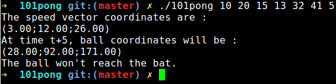

# 101pong
Epitech first year project : [CPE] 101pong
First mathematic module project of the year

Deadline : 2 weeks

Beginning of the project : 02/11/2015, 07h42

Group size : 2 person

Contributor : durand_4

# 101pong

Pong, developped as an arcade game in 1972 by Ralph Baer (Atari), is the first ever successful video game. It was in-
spired by the very first video game, Tennis for Two, developped in 1958 by William Higinbotham on an oscilloscope.

The goal of this project is to work on a 3d version of this game (or of the Brick Break game by the way...) ; only one bat
will be considered, moving only in the 0-altitude plan (which happens to be (Oxy)).

* [Pong](https://fr.wikipedia.org/wiki/Pong)

## Getting started

These instructions will allow you to obtain a copy of the operational project on your local machine for development and testing purposes.

### Prerequisites

What do you need to install the software and how to install it?

```
gcc
make
```

### Installation

Here's how to start the project on your computer

Clone and go in the directory 101pong

Project compilation

```
make
```

Running project

```
./101pong x0 y0 z0 x1 y1 z1 n
```
x0  ball abscissa at time t − 1

y0  ball ordinate at time t − 1

z0  ball altitude at time t − 1

x1  ball abscissa at time t

y1  ball ordinate at time t

z1  ball altitude at time t

n   time shift (greater than or equal to zero, integer


## Screenshot



## Build with

* [C](https://en.wikipedia.org/wiki/C_(programming_language))

## Auteurs

* **David Munoz** - [DavidMunoz-dev](https://github.com/davidmunoz-dev)
